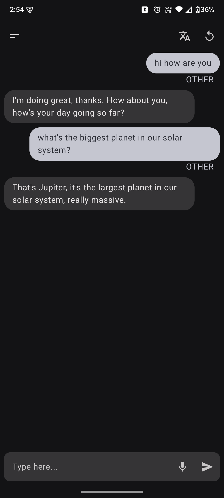
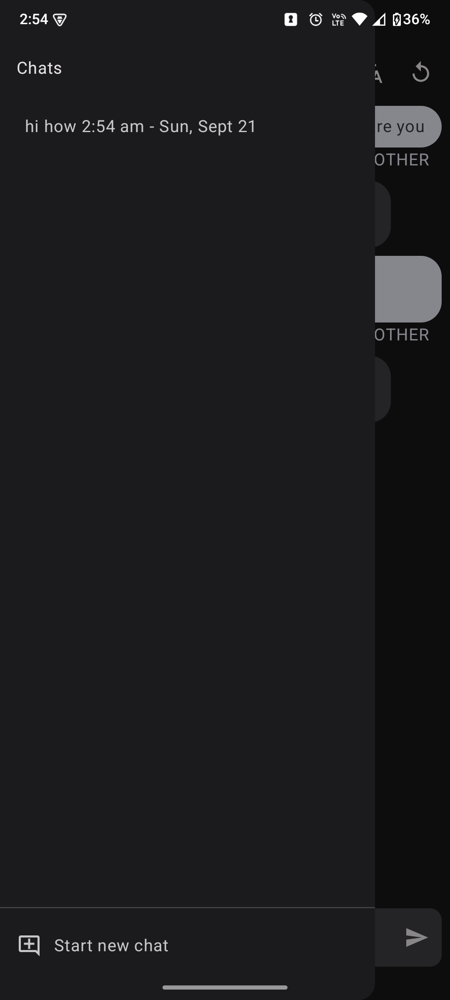
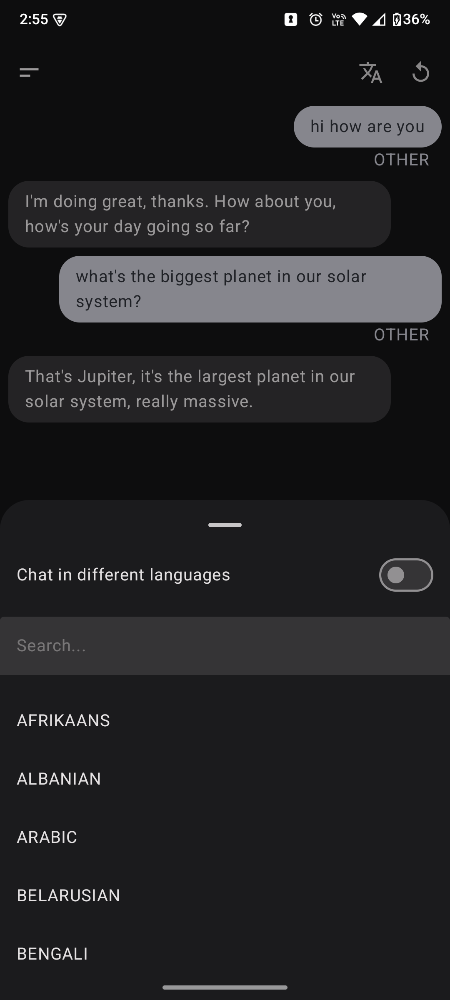

# AI Assistant Android App


## Demo & Screenshots

<p align="center">
  <b>App Overview:</b> <br/>
  
</p>

<p align="center">
  <b>Screenshots:</b> <br/>
</p>

<table align="center">
  <tr>
    <td>
      
    </td>
    <td>
      
    </td>
    <td>
      
    </td>
  </tr>
</table>

## Overview

Assistant is an Android application designed to act as a personal voice assistant. It can understand spoken commands, process them, and perform various actions like making calls, playing music, setting alarms, providing weather information, and more. The app integrates with several external services and uses on-device machine learning for intent recognition.

## Features

*   **Voice Commands:** Interact with the assistant using natural language.
*   **Text-to-Speech & Speech-to-Text:** Converts spoken language to text and vice-versa for interaction.
*   **Intent Classification:** Understands user intent and categorizes requests (e.g., Call, Music, Weather, Navigation, Alarm, Reminder).
*   **Phone Calls:** Can initiate phone calls to contacts.
*   **Music Playback:** Plays music via YouTube.
*   **Alarms & Reminders:** Set alarms and reminders.
*   **Navigation:** Provides navigation directions using Google Maps.
*   **Weather Information:** Fetches and displays weather forecasts for specified locations or current location.
*   **Large Language Model (LLM) Integration:** Uses Groq API for advanced query understanding and responses (can be changed as per requirement).
*   **Translation:** Supports language translation for input queries and responses.
*   **Conversation History:** Stores and displays past interactions.
*   **Customizable UI:** Offers options for UI presentation.

## Default Assistant App

This application can be set as the default assistant app on your Android device. This allows you to launch the app by long-pressing the home button or using other system-level gestures for invoking the assistant.

## Process Flow

```
Start (User Input on ChatScreen: Voice/Text)
  │
  V
MainViewModel (Input Processing, Permissions, Translation, Cleaning)
  │
  ├─+------------------------------------─> Lock Active? (e.g., Call/Song specific flow)
  │                                         │ (Yes)
  V (No / General Flow)                     │
Text Classification (Determine User Intent) Process Input based on Active Lock
  │                                         │
  V                                         │
Action Execution <──────────────────────────+
  (Based on Intent or Lock:
   - Make Call
   - Play Song
   - Navigate
   - Get Weather
   - Set Alarm/Reminder
   - Query General AI (Groq)
   - etc.)
  │
  V
Process Action Result (e.g., Format AI response, Translate back)
  │
  V
Update UI (ChatScreen displays conversation)
  │
  V
Speak Response (TextToSpeech, if enabled)
  │
  V
End
```

1.  **User Input:** The user provides input via voice or text in the `ChatScreen`.
2.  **Input Handling (`MainViewModel`):**
    *   The input is sent to the `MainViewModel`.
    *   Permissions (like microphone for voice input) are checked.
    *   If the input is not in English, it's translated to English.    *   The text is cleaned and punctuated.
3.  **Lock State Management (`MainViewModel`):**
    *   The current lock state is checked.
    *   If a specific lock is active (e.g., "call lock," "song lock"), the input is processed according to that lock.
    *   If no lock is active or the input is negative (e.g., "cancel"), the input proceeds to general classification.
4.  **Text Classification (`TextClassifierHelper` via `MainViewModel`):**
    *   The input text is classified to determine the user's intent (e.g., make a call, play a song, navigate, get weather, set alarm/reminder, or general query).
5.  **Action Execution (`CallCommand` & `MainViewModel`):**
    *   Based on the classified category, the `MainViewModel` (often via a `CallCommand` utility) triggers the appropriate action:
        *   **Call:** Initiates a phone call.
        *   **Songs:** Plays a song.
        *   **Navigation:** Starts navigation.
        *   **Weather:** Fetches weather information.
        *   **Alarm:** Sets an alarm.
        *   **Reminder:** Sets a reminder.
        *   **Other/Settings/General AI:** For other queries, or if the intent is unclear or relates to settings, the input is sent to a general AI (Groq API).
6.  **AI Response Processing (if applicable via `MainViewModel`):**
    *   The response from the Groq API is received.
    *   The response is processed and formatted.
    *   If the original input was not in English, the AI's English response is translated back to the original language.
7.  **Updating UI (`ChatScreen`):**
    *   The result of the action (e.g., confirmation of a call, song playing, navigation started, weather info, alarm/reminder set, or AI response) is added to the chat list in the `MainViewModel`.
    *   The `ChatScreen` observes changes in the chat list and updates to display the conversation.
8.  **Speech Output (if enabled via `MainViewModel`):**
    *   The response or confirmation is converted to speech using TextToSpeech.
    *   The synthesized speech is played back to the user.

## Technologies Used

*   **Kotlin:** Primary programming language.
*   **Jetpack Compose:** For building the user interface.
*   **Android Jetpack:**
    *   ViewModel: For managing UI-related data in a lifecycle-conscious way.
*   **Speech Recognition & Synthesis:** Android's built-in `SpeechRecognizer` and `TextToSpeech` engines.
*   **Text Classification:** MediaPipe, utilizing a custom-trained TensorFlow Lite (TFLite) model for on-device text classification.
*   **Offline Translation:** Google ML Kit for on-device language identification and translation, enabling completely offline functionality.
*   **Networking:** OkHttp for making API calls.
*   **APIs:**
    *   Groq API (for LLM, can be changed as per requirement)
    *   YouTube Data API v3 (for music search)
*   **Coroutines:** For asynchronous programming.

## Setup

1.  **Clone the repository:**
2.  **API Keys:**
    This project requires API keys for YouTube and Groq services. You need to create a `local.properties` file in the root directory of your project (if it doesn't already exist) and add your keys there:
    ```properties
    YOUTUBE_API_KEY=YOUR_YOUTUBE_API_KEY
    GROQ_API_KEY=YOUR_GROQ_API_KEY
    ```
    These keys are then accessed via `BuildConfig` fields in the app.

3.  **Ensure `local.properties` is in `.gitignore`:** The `.gitignore` file should include `local.properties` to prevent your API keys from being checked into version control.

## How to Build and Run

1.  Open the project in Android Studio.
2.  Let Android Studio sync the project and download necessary dependencies.
3.  Ensure you have an Android device or emulator connected/running.
4.  Click the "Run" button (green play icon) in Android Studio.

## Notes

*   The app requests various permissions at runtime (e.g., Record Audio, Read Contacts, Call Phone, Location) as needed for its features.
*   Bluetooth SCO is managed for better compatibility with Bluetooth headsets during speech recognition.

## License

This project is licensed under the MIT License - see the [LICENSE](LICENSE) file for details.
Copyright (c) 2025 Sourav Anand
